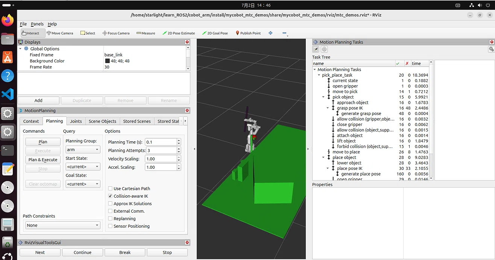
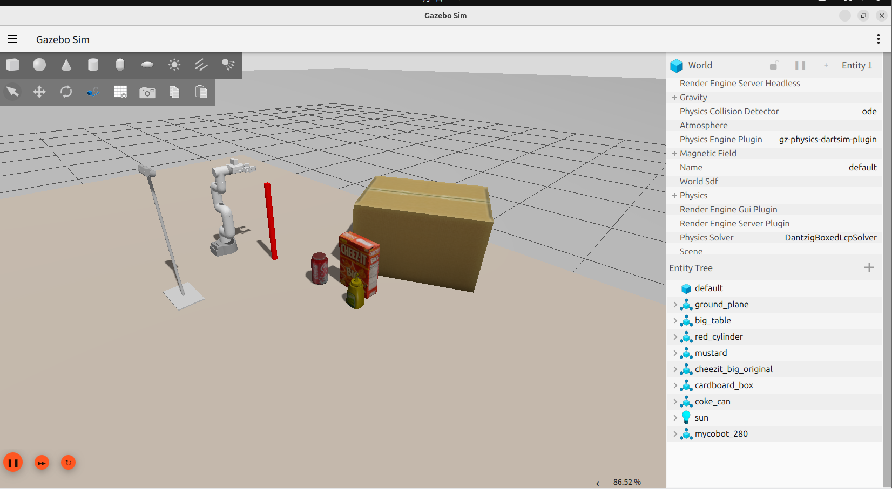
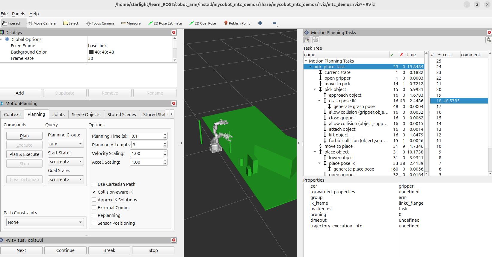
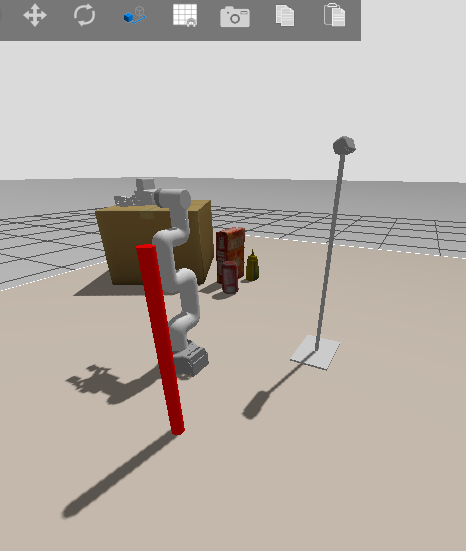
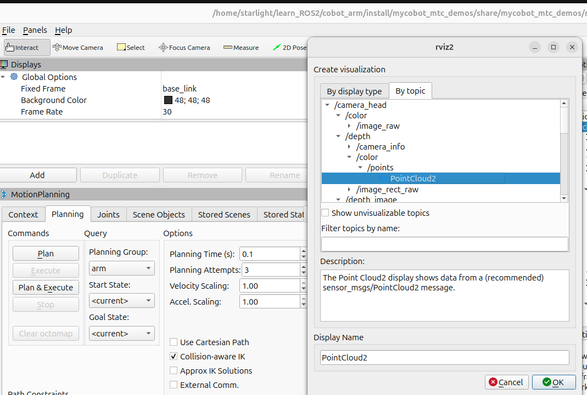
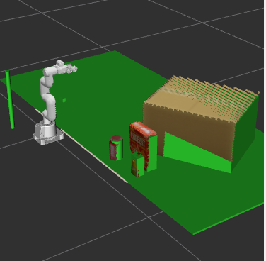

# myCobot MTC Pick and Place Demo

# 🤖 myCobot MTC Pick and Place Demo

**基于 ROS2 Jazzy \+ MoveIt Task Constructor 的 myCobot 机械臂视觉引导拾放演示系统**，在 Gazebo 仿真环境中实现环境感知、3D点云处理、物体识别、智能运动规划、全自动拾放任务执行的完整机器人作业闭环。

# 基础显示




## 📌 项目简介

本项目针对 **myCobot 280 机械臂** 开发，依托 ROS2 Jazzy 生态，结合 MoveIt Task Constructor（MTC）任务框架与 PCL 3D点云处理算法，搭建了一套**纯仿真视觉引导自动拾放系统**。

系统通过 Gazebo 仿真 RGB\-D 相机采集环境点云与图像数据，经过完整的点云处理流水线完成桌面平面分割、目标物体聚类、特征提取、形状匹配识别，再通过 MTC 构建多阶段、高鲁棒性的拾取\-放置任务，自动规划无碰撞轨迹并驱动机械臂完成物体搬运作业，完整复刻工业机械臂视觉抓取作业流程。

**核心能力概述**：

- ✅ **环境智能感知**：自动识别支撑桌面平面、场景障碍物与目标物体

- ✅ **多物体识别适配**：支持圆柱体、立方体盒子两类典型物体精准识别

- ✅ **完整MTC任务规划**：自动构建接近、抓取、提升、搬运、放置、退避全流程任务

- ✅ **混合规划策略**：结合OMPL全局规划 \+ 笛卡尔直线局部规划，轨迹平滑无抖动

- ✅ **精细化碰撞管理**：动态修改规划场景碰撞规则，适配抓取、放置特殊工况

- ✅ **双模式运行**：支持仅规划可视化调试 / 规划\+实物仿真执行

- ✅ **全参数可配置**：感知、规划、任务参数全部YAML化，快速迭代适配场景

## 🏗️ 系统整体架构

本系统采用**感知层\-规划层\-执行层**三级架构，数据流转清晰、模块化解耦：

```Plain Text
Gazebo仿真环境（myCobot280 + RGB-D相机 + 桌面 + 目标物体）
        │ 点云 + RGB图像数据输出
        ▼
GetPlanningSceneServer 感知服务端
        │ 点云预处理 → 平面分割 → 特征估计 → 聚类提取 → 物体分割 → 目标匹配
        │ 输出：碰撞物体列表、目标物体ID、支撑平面ID
        ▼
MTCTaskNode MTC任务规划节点
        │ 任务构建 → 多阶段轨迹规划 → 姿态采样+IK求解 → 轨迹验证
        │ 标准拾放流程：接近→抓取→提升→移动→放置→退避→回零
        ▼
MoveIt2 + Gazebo仿真控制器
        │ 轨迹下发 + 机械臂运动执行 + 场景动态更新
        ▼
完成全自动视觉拾放任务
```

## 🧩 核心功能模块详解

### 1\. 3D环境感知模块（PCL点云处理）

作为系统前置核心模块，完成原始点云到结构化场景信息的转换，为运动规划提供精准环境数据支撑，包含全套自研点云处理流水线：

- **平面分割（plane\_segmentation\.cpp）**：基于法向量估计、欧氏聚类、RANSAC平面拟合与多维度评分机制，精准分割桌面支撑平面，过滤无效环境噪点。

- **特征估计（normals\_curvature\_and\_rsd\_estimation\.cpp）**：通过PCA\+MLESAC鲁棒拟合算法，计算点云法向量、曲率、RSD表面描述符，实现边界点检测，为后续聚类提供特征依据。

- **聚类提取（cluster\_extraction\.cpp）**：采用区域生长算法，基于平滑度、曲率双阈值筛选，从场景点云中分割出独立物体聚类。

- **物体分割（object\_segmentation\.cpp）**：将3D点云投影至2D平面，结合RANSAC直线/圆拟合、Hough变换投票算法，精准拟合圆柱体、立方体碰撞模型。

- **目标匹配（get\_planning\_scene\_server\.cpp）**：通过形状类型、尺寸相似度双重评分机制，匹配最优目标物体，输出标准化场景参数。

### 2\. MTC运动规划模块

基于 MoveIt Task Constructor 搭建标准化、可复用的机械臂拾放任务模板，替代传统固定轨迹编程，实现自适应智能规划：

- 自动读取机械臂当前状态，初始化夹爪张开姿态

- 全局路径采用 **OMPL规划器**，实现无障碍长距离移动

- 抓取/放置近距离动作采用 **笛卡尔直线规划**，保证运动平稳精准

- 多方向抓取姿态采样 \+ 逆解IK求解，自动筛选最优抓取角度

- 动态规划场景管理：按需开启/关闭夹爪\-物体、物体\-桌面碰撞检测

- 全流程任务串行容器封装，步骤闭环、逻辑可控

### 3\. 任务执行与调试模块

- 双运行模式：`execute:=true` 执行轨迹 / `execute:=false` 仅规划可视化调试

- 内置轨迹碰撞检测、工作空间边界校验、时间最优平滑参数化

- 实时发布任务状态、轨迹信息，支持RViz全流程可视化监控

## 📦 支持识别的物体类型

- **圆柱体 CYLINDER**：3D点云2D投影 → RANSAC圆拟合 → Hough投票 → 圆柱体模型匹配生成碰撞体

- **立方体 BOX**：3D点云2D投影 → RANSAC直线拟合 → Hough投票 → 矩形边框拟合生成立方体碰撞体


## 💻 运行环境要求

- **操作系统**：Ubuntu  24\.04 LTS

- **ROS版本**：ROS 2 Jazzy

- **仿真环境**：Gazebo Harmonic

- **核心依赖**：MoveIt 2、MoveIt Task Constructor、PCL 1\.12\+、Eigen3、TF2

## 🔧 环境安装与编译

### 安装核心依赖

```Plain Text
# 安装ROS2 MoveIt及MTC核心包
sudo apt install ros-jazzy-ros-base ros-jazzy-moveit ros-jazzy-moveit-task-constructor -y

# 安装PCL点云库与线性代数库
sudo apt install libpcl-dev libeigen3-dev -y

```


## 🚀 项目启动方式

### 方式一：一键启动（推荐）

```Plain Text
./src/mycobot_mtc_pick_place_demo/scripts/robot.sh

```

### 方式二：分步启动（便于调试）

```Plain Text
# 1. 启动Gazebo仿真场景（开启相机+仿真时间）
ros2 launch mycobot_gazebo mycobot.gazebo.launch.py \
    world_file:=pick_and_place_demo.world \
    use_camera:=true \
    use_sim_time:=true \
    z:=0.78

# 2. 启动MoveIt与RViz可视化
ros2 launch mycobot_moveit_config move_group.launch.py \
    rviz_config_file:=mtc_demos.rviz

# 3. 启动3D感知服务
ros2 launch mycobot_mtc_pick_place_demo get_planning_scene_server.launch.py

# 4. 启动MTC拾放任务（execute=true执行轨迹，false仅规划）
ros2 launch mycobot_mtc_pick_place_demo pick_place_demo.launch.py execute:=true

```

# 启动夹取



完全启动后，机械臂会自动根据要夹取的目标，自己计算出夹取的最佳路径，在计算完成后在右边的Motiog planning task窗口，点击pick_place_task,在右边
会显示出代价最小的那一个夹取方法，选中后点击右上角的小齿轮图标即可执行夹取

夹取完成后可以看到gazebo也正常执行



提示：如果在虚拟机下执行，请确保内存足够，否则可能会导致报错溢出无法执行，可关闭vscode以纯终端运行，建议报错后先关闭在重启虚拟机再运行

# 查看深度摄像机点云显示



在rviz2左边窗口添加话题ADD,选择如图所示，即可查看点云，如想观看摄像头画面可选image_raw



## ⚙️ 核心参数配置说明

### 1\. 感知服务参数（get\_planning\_scene\_server\.yaml）

- **target\_frame**：任务基准坐标系，默认 `base_link`

- **z\_tolerance**：平面高度容错阈值，适配仿真微小误差，默认 0\.5

- **min\_cluster\_size**：有效物体最小点云数量，过滤噪点，默认 50

- **smoothness\_threshold**：区域生长平滑度阈值（°），默认 20\.0

- **curvature\_threshold**：区域生长曲率阈值，默认 0\.2

### 2\. MTC任务参数（mtc\_params\.yaml）

- **object\_pose**：目标物体初始位姿 \[x,y,z,roll,pitch,yaw\]

- **place\_pose**：物体目标放置位姿

- **object\_dimensions**：物体尺寸参数（圆柱体：\[高度,半径\]）

- **max\_solutions**：规划最大求解方案数，默认25

- **grasp\_pose\_angle\_delta**：抓取姿态采样角度步长，默认7\.5°

## 📏 场景参数同步规则

修改仿真场景后需同步对应参数，避免规划、识别异常：

- 修改桌面尺寸 → 同步更新`get_planning_scene_server.yaml` 点云裁剪范围

- 修改桌面高度 → 同步修改启动脚本机械臂基座Z值、放置位姿Z值

- 修改物体位置/尺寸 → 同步更新 `mtc_params.yaml` 位姿与尺寸参数

## 🔍 RViz可视化调试内容

启动自定义RViz配置后，可实时监控全流程状态：

- myCobot机械臂实时模型与关节状态

- 仿真环境原始点云数据、聚类物体点云

- 场景碰撞体、支撑平面可视化

- MTC完整任务树、规划轨迹路径

## 🐛 常见问题排查

- **物体无法识别**：物体名称、尺寸参数与world场景不匹配，核对yaml参数与仿真模型参数

- **机械臂可达性失败**：基座Z坐标、目标位姿超出机械臂工作空间，微调坐标参数

- **放置物体倾倒**：放置高度异常，保证放置Z值与桌面高度匹配

- **点云数据为空**：未开启相机仿真，确认启动参数 `use_camera:=true`

- **平面检测失败**：平面容错阈值过小，适当增大 `z_tolerance`

- **轨迹规划失败**：目标位置超出工作空间或存在碰撞，调整位姿参数

## 📚 项目依赖与参考资源

**核心依赖**：ROS2 Jazzy、MoveIt 2、MoveIt Task Constructor、Gazebo、PCL、Eigen3、TF2

**官方参考文档**：

- [MoveIt Task Constructor 官方文档](https://moveit.picknik.ai/main/doc/task_constructor/task_constructor.html)

- [ROS2 Jazzy 官方文档](https://docs.ros.org/en/jazzy/)

- [PCL 点云库官方文档](https://pointclouds.org/)

- [MoveIt 2 官方文档](https://moveit.picknik.ai/)

## 📄 许可证

本项目仅供**学习与科研用途**，欢迎Star、Fork、二次开发与迭代优化，禁止用于商业用途。
原作者项目网站：https://automaticaddison.com/configure-moveit-2-for-a-simulated-robot-arm-ros-2-jazzy

## 🙋 项目支持

如果本项目对你有帮助，欢迎点亮 **⭐ Star**，有任何问题、BUG反馈或功能拓展需求，欢迎提交 **Issue**！持续更新优化ROS2机械臂视觉规划相关功能！

